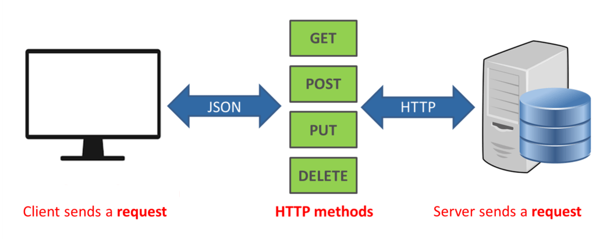

#  WRRC and Java
we present a way of performing HTTP requests in Java — by using the built-in Java class HttpUrlConnection.

**The HTTP Request Lifecycle:**

1-Step 1: Local Processing 
browser extracts the "scheme"/protocol (we have establishedthat this will be HTTP)

will be like that |http|://|www.example.com||:5000||/mainpage||?query=param&query2=param2|

1-url 2-port 3-resource path 4-query strings that are specified in the form

Step 2: Resolve an IP

Step 3: Establish a TCP Connection
 
Step 4: Send an HTTP Request
 
Step 5: Tearing Down and Cleaning Up

## HttpUrlConnection
The HttpUrlConnection class allows us to perform basic HTTP requests without the use of any
additional libraries. All the classes that we need are part of the java.net package.
The disadvantages of using this method ,it does not provide more advanced functionalities.

**- Creating a Request*8
We can create an HttpUrlConnection instance using the openConnection() method of the URL class
only creates a connection object but doesn't establish the connection yet.

**request Methods:**

-GET

-POST

-HEAD

-OPTIONS, 

-PUT

-DELETE

-TRACE

Let's create a connection to a given URL using GET method:

>URL url = new URL("http://example.com");
 HttpURLConnection con = (HttpURLConnection) url.openConnection();
 con.setRequestMethod("GET");
 
 **-Adding Request Parameters**
 If we want to add parameters to a request, we have to set the doOutput property to true,
 then write a String of the form param1=value¶m2=value to the OutputStream of the HttpUrlConnection instance:
 
Map<String, String> parameters = new HashMap<>();

parameters.put("param1", "val");

con.setDoOutput(true);

DataOutputStream out = new DataOutputStream(con.getOutputStream());

out.writeBytes(ParameterStringBuilder.getParamsString(parameters));

out.flush();

out.close();

**- Setting Request Headers**

 Adding headers to a request can be achieved by using the setRequestProperty() method:
 >con.setRequestProperty("Content-Type", "application/json");

To read the value of a header from a connection, we can use the getHeaderField() method:
>String contentType = con.getHeaderField("Content-Type");

**- Configuring Timeouts**
HttpUrlConnection class allows setting the connect and read timeouts. These values define the interval of time
to wait for the connection to the server to be established or data to be available for reading.

To set the timeout values, we can use the setConnectTimeout() and setReadTimeout() methods:
>con.setConnectTimeout(5000);
con.setReadTimeout(5000);

**- Handling Cookies**
>String cookiesHeader = con.getHeaderField("Set-Cookie");
List<HttpCookie> cookies = HttpCookie.parse(cookiesHeader);
  
**-Handling Redirects**
 >con.setInstanceFollowRedirects(false);

**-Reading the Response**
  >int status = con.getResponseCode();
  
**-Reading the Response on Failed Requests**
  
  int status = con.getResponseCode();

Reader streamReader = null;

if (status > 299) {
    streamReader = new InputStreamReader(con.getErrorStream());
} else {
    streamReader = new InputStreamReader(con.getInputStream());
}
  
  
  
**-Building the Full Response**
  
  public class FullResponseBuilder {
  
    public static String getFullResponse(HttpURLConnection con) throws IOException {
  
        StringBuilder fullResponseBuilder = new StringBuilder();

        // read status and message

        // read headers

        // read response content

        return fullResponseBuilder.toString();
    }
}
  
  

  

 

