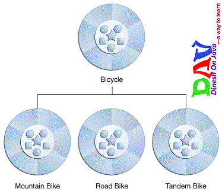

# Inheritance 
there is class called superclass that contain set of subclasses ,superclass dont have class above it ,subclasses are children of superclass ,that get the properties 
of superclass .
so inheritance are the relation between superclass and subclass , that the property and methods are inherts to subclass from superclass .
as u can see  in below picture ,superclass are the bicycle and subclasses are the different types of bicycles ,so each bicycle has 
the common thing that it take it from superclass.

he syntax for creating a subclass is simple. At the beginning of your class declaration, use the extends keyword, followed by the name of the class to inherit from:

>class MountainBike extends Bicycle {}

# interface
 an interface is a group of related methods with empty bodies.interface cant instantiated ,they only implemented by classes ,or extended by other interface A bicycle's
 behavior, if specified as an interface , might appear as follows:
 
 interface BicycleInterface {

    //  wheel revolutions per minute
    void changeCadence(int newValue);

    void changeGear(int newValue);

    void speedUp(int increment);

    void applyBrakes(int decrement);
}

note :as u can see in code above the method dont braces ,end with semicolon ,it's instantiated 
by the declartion class.

to implement that interface in specific class , use keyword **implements** , as follows :

class MountainBicycle implements BicycleInterface{
    void changeCadence(int newValue) {
         cadence = newValue;
    }

    void changeGear(int newValue) {
         gear = newValue;
    }

    void speedUp(int increment) {
         speed = speed + increment;   
    }

    void applyBrakes(int decrement) {
         speed = speed - decrement;
    }

}
