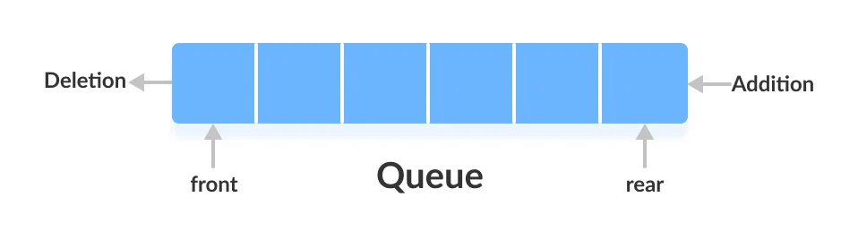

# stacks And Queues

## Stack
A stack is a data structure that consists of Nodes. Each Node references the next Node in the stack, but does not reference its previous.

stacks methods are the following :

-push :to add the value at the top of stack 

note :top is the index where u begin to delete or add values above it.

-pop :to delete the value at the top

-peek :to know the value at the top

-isEmpty to know if the stack is empty or not

note :if u use peek or pop ,and the stack was empty ,an exception will appear.

stack is FILO which stands for First in Last out ,mean that first item in stack will pop out last one.

## Queue
represents a data structure designed to have elements inserted at the end of the queue, and elements removed from the
beginning of the queue. This is similar to how a queue in a supermarket works.

Queue terminology :

-Enqueue :show u the items in queue

-Dequeue : show u the items removed in queue

-Front :the first item in queue

-Rear : the last item in queue

-Dequeue :show all front items in queue

-isEmpty : ensure if queue are empty or not 

note :if u use Dequeue or Dequeue when the queue is empty ,Exception will appear.

queue is LIFO which stand for Last In First out , which mean last item of queue will be the last item of queue.

